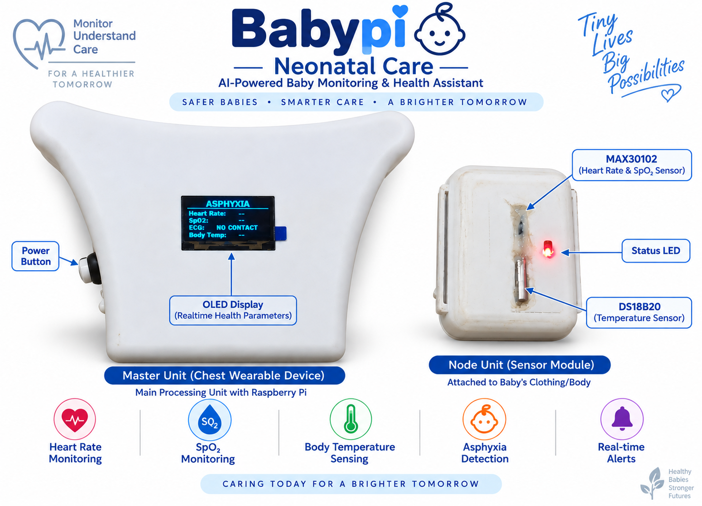

# 🍼 BabyPI — Edge-AI Neonatal Monitoring & Baby Cry Analysis

<p align="center">
  
</p>

<p align="center">
  <b>Edge AI • ECG • SpO₂ • Temperature • Baby Cry Analysis • VitalScope</b>
</p>

---
<p align="center">
  <b>Edge AI • Embedded Systems • ECG • SpO₂ • Temperature • Smart Power Management • Real-Time Monitoring</b>
</p>

<p align="center">
  <a href="https://babypi.lovable.app/">🌐 Live VitalScope Dashboard</a>
</p>

---

## Overview

**BabyPI** is an experimental edge-AI neonatal monitoring and baby-cry analysis platform built around a **Raspberry Pi Zero 2 W master controller**, an **ESP32 wearable sensor node**, and an **ATtiny402-based power-management controller**.

The system combines:

- Baby-cry audio analysis using an INMP441 I²S microphone
- AI/ML-based cry classification
- ECG acquisition using AD8232
- ADS1115 ADC acquisition
- MAX30102 pulse/SpO₂ sensing through the ESP32 node
- DS18B20 temperature sensing
- SH1106 OLED local display
- Battery-voltage monitoring
- ATtiny402 hardware power latching
- Low-battery protection
- Controlled Raspberry Pi shutdown
- Single push-button power/control
- Automatic Raspberry Pi IP discovery
- ESP32 ↔ Raspberry Pi wireless communication
- Real-time VitalScope browser monitoring
- Live ECG visualization
- Recorded-data export as `.xlsx`

> **Medical disclaimer:** BabyPI is a research/engineering prototype, not a certified medical device. Its measurements and AI outputs are not intended to diagnose, treat, or replace professional medical care.

---

# System Architecture

<p align="center">
  
</p>
```
# **Schematic Digram**
<p align="center">
  
</p>

---

# Main Hardware

| Component | Function |
|---|---|
| Raspberry Pi Zero 2 W | Main processing/controller |
| INMP441 | Digital I²S microphone |
| AD8232 | ECG signal acquisition |
| ADS1115 | High-resolution ADC |
| SH1106 OLED | Local status display |
| ESP32 | Wireless wearable sensor node |
| MAX30102 | Optical pulse/SpO₂ sensing |
| DS18B20 | Temperature sensing |
| ATtiny402 | Power-management controller |
| Voltage divider | Battery-voltage measurement |
| Push button | Single-button system control |

---

# Baby Cry AI

The audio-processing pipeline is:

```text
Baby Cry
   ↓
INMP441
   ↓
16 kHz Mono Audio
   ↓
Pre-processing
   ↓
MFCC Extraction
   ↓
AI Model
   ↓
Classification
   ↓
Raspberry Pi / OLED / VitalScope
```

### Audio configuration

| Parameter | Value |
|---|---:|
| Sampling rate | 16 kHz |
| Channels | Mono |
| MFCC coefficients | 24 |
| Window length | 25 ms |
| Window step | 10 ms |
| FFT size | 1024 |
| Maximum frames | 500 |

The project has experimented with:

- XGBoost
- Random Forest
- SVM
- TensorFlow
- TensorFlow Lite

A documented neural-network model contains approximately **3,167,778 parameters**.

The exact classification labels depend on the model/dataset version. Development has included classes such as Normal, Hunger, Pain, Asphyxia, and Deaf-related classification.

### Important limitation

Cry acoustics alone cannot establish a clinical diagnosis. AI output in this project should be treated as an experimental classification signal.

---

# ECG Monitoring

```text
AD8232
   ↓
ADS1115
   ↓
Raspberry Pi Zero 2 W
   ↓
ECG Processing
   ├──► OLED
   └──► VitalScope
```

VitalScope can display the ECG waveform in real time.

---

# Wearable ESP32 Node

The ESP32 is used as a distributed physiological-sensing node.

```text
ESP32
 ├── MAX30102
 │    └── Pulse / SpO₂-related measurements
 │
 └── DS18B20
      └── Temperature
```

The node communicates wirelessly with the Raspberry Pi.

---

# Automatic Raspberry Pi IP Discovery

The Raspberry Pi can receive a different local IP address depending on the Wi-Fi/DHCP environment.

BabyPI therefore uses an automatic discovery mechanism rather than depending only on one hard-coded Raspberry Pi address.

```text
ESP32
  ↓
Network Discovery
  ↓
Raspberry Pi
  ↓
Current Pi address
  ↓
ESP32 communication
```

This is a networking-resilience feature. It should not be described as proof of medical-device or IEEE regulatory compliance.

---

# ATtiny402 Power Management

The ATtiny402 controls the Raspberry Pi power path and provides a hardware-assisted shutdown architecture.

### Functions

- Single push-button control
- Power ON
- Power OFF
- Power latch
- Battery monitoring
- Low-battery detection
- Raspberry Pi shutdown trigger
- Controlled power removal

### Shutdown sequence

```text
Low battery
    ↓
ATtiny402 detects condition
    ↓
Shutdown request
    ↓
Raspberry Pi Linux shutdown
    ↓
Operating system stops
    ↓
ATtiny402 removes power
```

The goal is to reduce the risk of filesystem corruption caused by uncontrolled power removal.

---

# VitalScope

Live browser dashboard:

**https://babypi.lovable.app/**

VitalScope is used for real-time visualization of the monitoring system.

It can display:

- ECG waveform
- Heart-rate information
- SpO₂ information
- Temperature
- Cry-analysis result
- System/sensor status
- Recorded data

Recorded information can be exported as an `.xlsx` file.

---

# Repository Structure

This repository intentionally keeps the major development components visible:

```text
BabyPI/
│
├── Attiny402_latching_code/
│   └── ATtiny402 power-management firmware
│
├── data_set-feature_cache/
│   └── Cached ML features
│
├── ESP32_node/
│   └── ESP32 wearable-node firmware
│
├── Images/
│   └── Project photographs and screenshots
│
├── Librosa_models/
│   └── Audio/Librosa model resources
│
├── Model/
│   └── AI models and model resources
│
├── PCB&Schematics/
│   └── Hardware design files
│
├── Raspberry_pi_master/
│   └── Raspberry Pi master software
│
├── Report/
│   └── Project documentation and reports
│
├── training/
│   └── AI training and experimentation
│
├── video/
│   └── Demonstration media
│
├── pi_zero_2w_4thread_no_resample/
│   └── Raspberry Pi performance experiment
│
├── pi_zero_2w_limited_test/
│   └── Raspberry Pi testing
│
├── pi_zero_2w_old_model_new_features/
│   └── Earlier model/software experiment
│
├── run/
│   └── Runtime/development scripts
│
├── RUNPI/
│   └── Raspberry Pi launch/runtime scripts
│
├── requirements.txt
├── training_requirements.txt
├── .gitignore
└── README.md
```

---

# Software Stack

### Raspberry Pi

- Python
- NumPy
- SciPy
- Librosa
- SoundFile
- Joblib
- XGBoost
- TensorFlow Lite Runtime
- SoundDevice
- Flask
- Adafruit Blinka
- Adafruit ADS1x15
- Luma OLED

### AI / Training

- Python
- TensorFlow
- Scikit-learn
- XGBoost
- Librosa
- NumPy
- SciPy
- Pandas
- Matplotlib

### Embedded

- ESP32
- ATtiny402
- Wi-Fi
- I²C
- I²S
- 1-Wire
- GPIO
- ADC

---

# Installation

## Raspberry Pi

```bash
git clone https://github.com/<YOUR_USERNAME>/BabyPI.git
cd BabyPI

python3 -m venv .venv
source .venv/bin/activate

pip install -r requirements.txt
```

Hardware-specific Linux packages may also be required depending on the Raspberry Pi OS image and audio configuration.

## AI Training PC

Use a separate environment:

```bash
python -m venv .venv
```

Windows:

```bash
.venv\Scripts\activate
```

Linux:

```bash
source .venv/bin/activate
```

Then:

```bash
pip install -r training_requirements.txt
```

Do not install the complete training environment on the Raspberry Pi Zero 2 W unless specifically required.

---

# Hardware Testing

Recommended test order:

### Raspberry Pi

1. Boot
2. I²C detection
3. OLED
4. ADS1115
5. Battery voltage
6. INMP441/audio
7. AD8232/ECG
8. AI inference
9. Wi-Fi
10. VitalScope

### ESP32

1. ESP32 boot
2. Wi-Fi
3. MAX30102
4. DS18B20
5. Raspberry Pi discovery
6. Data transmission

### ATtiny402

1. Button
2. Latch
3. Power ON
4. Shutdown request
5. Low-battery detection
6. Power OFF

---

# Security and Privacy

Never commit:

- Wi-Fi passwords
- API keys
- Authentication tokens
- Private keys
- `.env` files
- Private infant recordings
- Identifiable medical data
- Private ECG logs

The repository's `.gitignore` is configured to exclude common secrets, recordings, caches, logs, and generated files.

---

# Medical / Research Disclaimer

BabyPI is an **experimental research and engineering prototype**.

It is not a certified medical device and is not intended to:

- Diagnose disease
- Replace professional medical care
- Replace certified neonatal monitoring equipment
- Make emergency medical decisions
- Diagnose a condition from crying alone

Formal medical deployment would require appropriate calibration, validation, clinical evaluation, risk management, software lifecycle controls, cybersecurity, electrical safety testing, human-factors evaluation, and applicable regulatory/standards assessment.

---

# Future Development

- Custom integrated PCB
- Smaller wearable enclosure
- Improved battery-management system
- Dedicated battery fuel gauge
- Better audio noise suppression
- Larger and independently validated datasets
- Improved AI generalization
- Model quantization
- Secure communication
- Device authentication
- OTA firmware updates
- Improved ECG processing
- Automated device diagnostics
- Formal verification and validation

---

# Project Demonstration

Add your actual project photographs to the `Images/` folder.

Suggested README images:

```markdown


```

Add the demonstration video link from the `video/` folder or from your preferred video-hosting service.

---

# Author

**Raghul**

B.E. Electrical and Electronics Engineering

Areas:

- Embedded Systems
- Edge AI
- Machine Learning
- Signal Processing
- IoT
- Robotics
- Hardware Design

---

# ⭐ BabyPI in One Line

> **An edge-AI neonatal monitoring research platform combining baby-cry analysis, ECG, SpO₂, temperature sensing, wearable ESP32 communication, intelligent power management, and real-time browser visualization.**

---

## Live Dashboard

🌐 **VitalScope:** https://babypi.lovable.app/
